# SIPADI Frontend

## Overview

SIPADI Frontend is the user interface for the SIPADI (Academic Information System) project, built with Next.js and React. It provides role-based dashboards for administrators, teachers, and students to manage academic activities efficiently.

## Features

- **Role-Based Access Control**: Separate dashboards for ADMIN, TEACHER, and STUDENT roles.
- **Authentication**: JWT-based login with token storage in cookies.
- **Middleware Protection**: Route protection and redirection based on user roles and token validity.
- **Dashboards**: Customized interfaces for managing attendances, classes, subjects, assignments, reports, etc.
- **Responsive Design**: Clean, modern UI that works across devices.
- **API Integration**: Communicates with NestJS backend via REST API.

## Tech Stack

- **Framework**: Next.js (App Router)
- **Library**: React
- **Styling**: Tailwind CSS
- **Authentication**: JWT
- **State Management**: React Hooks
- **Build Tool**: Next.js CLI

## Project Structure

```
sipadi-fe/
├── public/
│   └── images/
├── src/
│   ├── app/                 # Next.js App Router pages
│   │   ├── admin/           # Admin routes
│   │   ├── auth/            # Authentication
│   │   ├── student/         # Student routes
│   │   └── teacher/         # Teacher routes
│   ├── components/          # Reusable UI components
│   │   ├── layout/          # Layout components
│   │   └── ui/              # Basic UI elements
│   ├── features/            # Feature-specific components
│   ├── lib/                 # Utilities (JWT, client, etc.)
│   ├── services/            # API service functions
│   └── types/               # TypeScript type definitions
├── next.config.ts
├── package.json
├── postcss.config.mjs
├── tsconfig.json
└── README.md
```

## Installation

1. Clone the repository:

   ```
   git clone https://github.com/Revou-FSSE-Jun25/crack-fe-Yous1705.git
   cd sipadi-fe
   ```

2. Install dependencies:
   ```
   npm install
   ```

## Running the Application

1. Start the development server:

   ```
   npm run dev
   ```

2. Open [http://localhost:3000](http://localhost:3000) in your browser.

## Authentication & Authorization Flow

- Users log in via the `/auth/login` page.
- Upon successful login, a JWT access token is stored in cookies.
- Middleware checks the token on protected routes:
  - Redirects to login if no token or expired.
  - Redirects to appropriate dashboard based on user role (ADMIN, TEACHER, STUDENT).
- Role-based access ensures users can only access authorized sections.

## Live Demo

Visit the live application at: [https://sipadi-fe-production.up.railway.app/](https://sipadi-fe-production.up.railway.app/)

## Screenshots

### Admin Dashboard

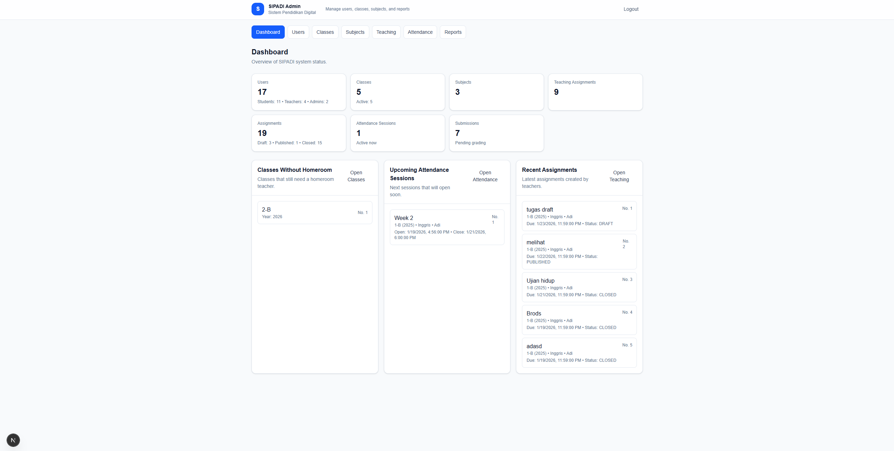

### Admin Attendance

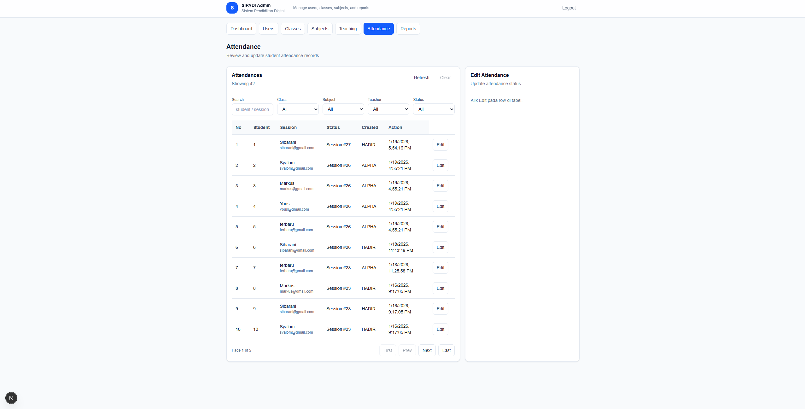

### Admin Classes

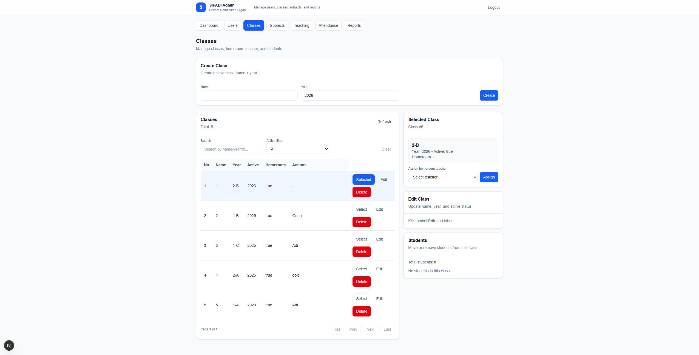

### Admin Subjects

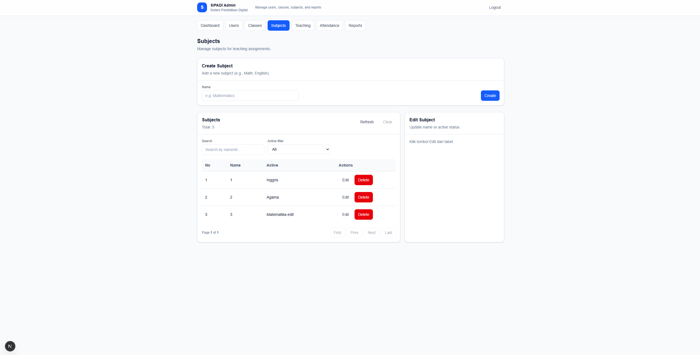

### Admin Summary

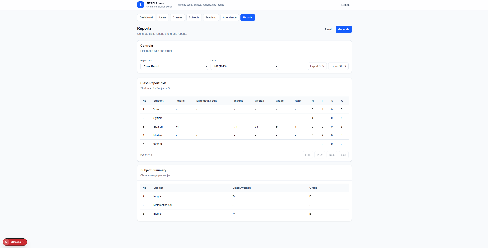

### Admin Teaching

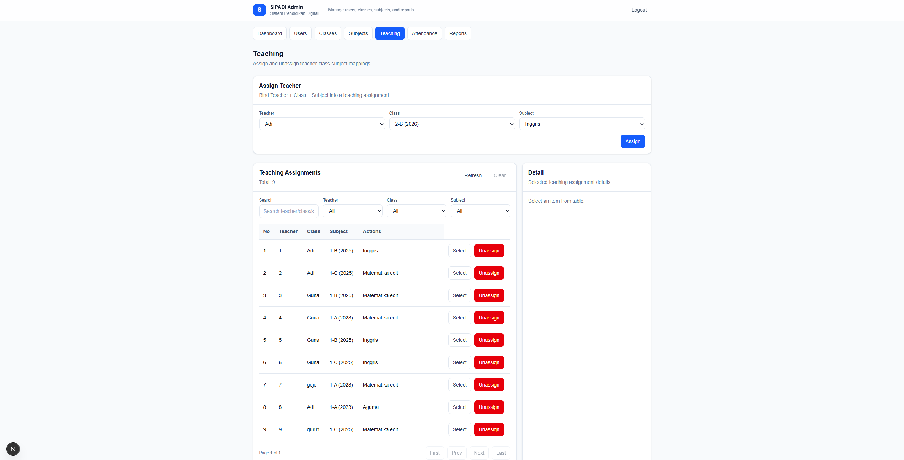

### Admin Users

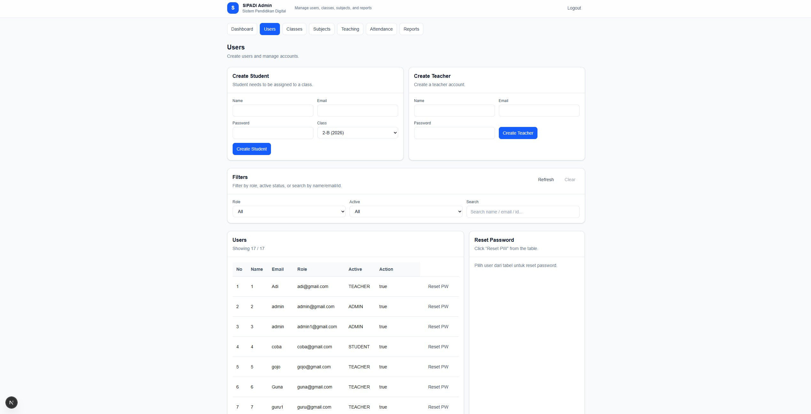

### Student Dashboard

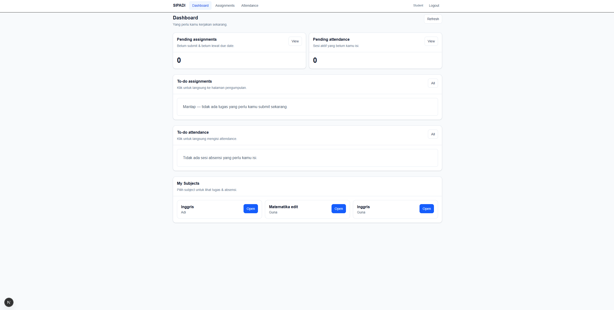

### Student Attendance

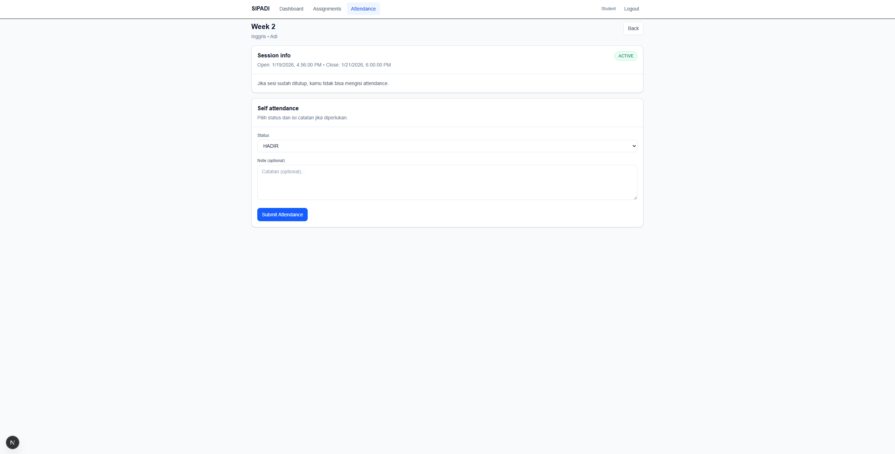

### Student Submission

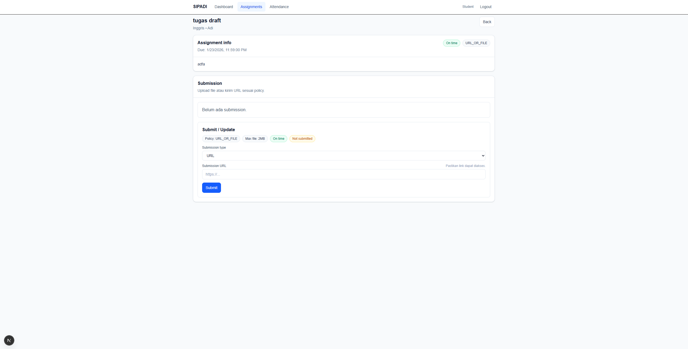

### Teacher Dashboard

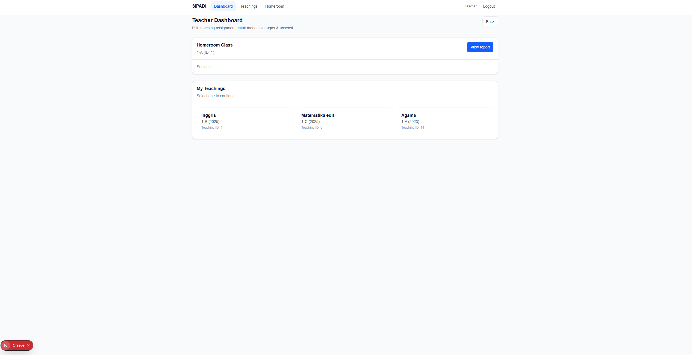

### Teacher Create Assignment

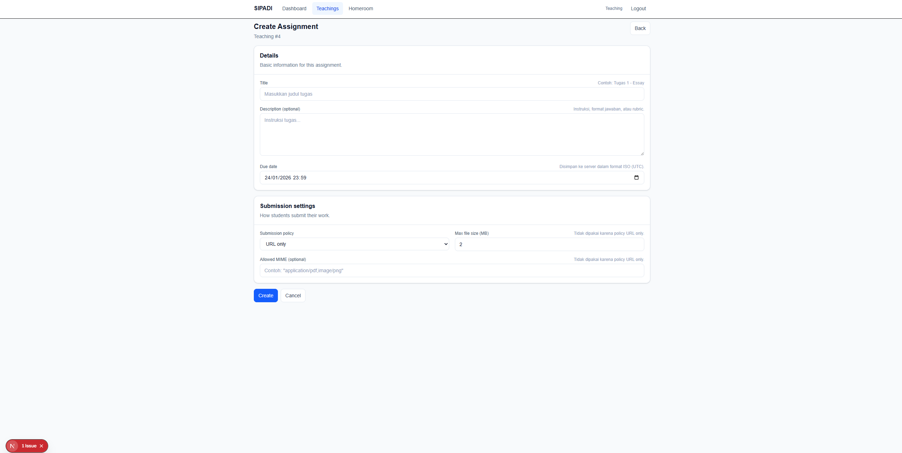

### Teacher Create Session

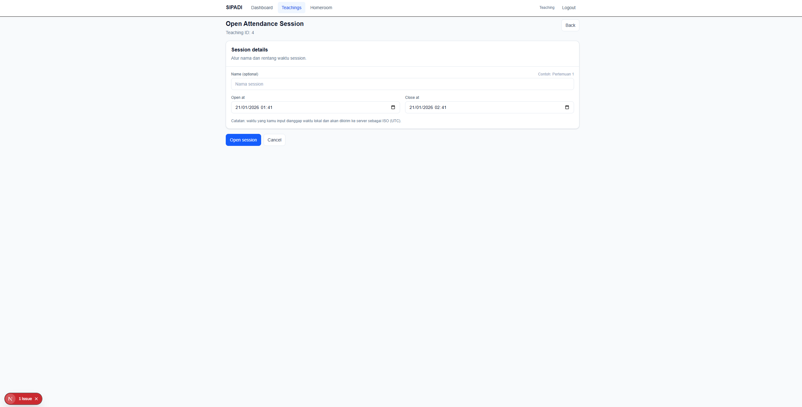

### Teacher Grade

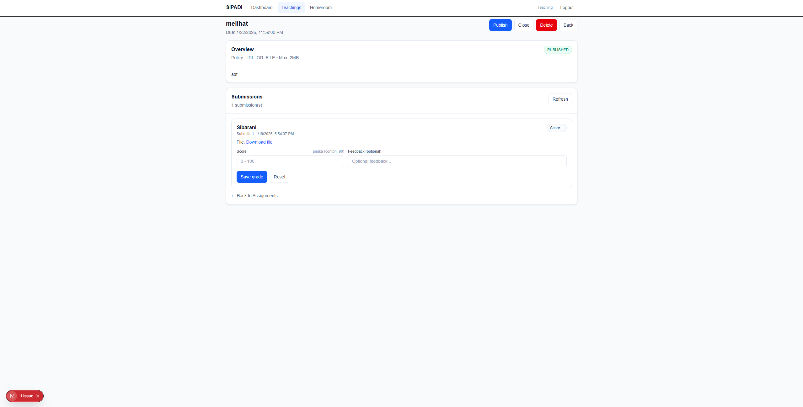

### Teacher Report

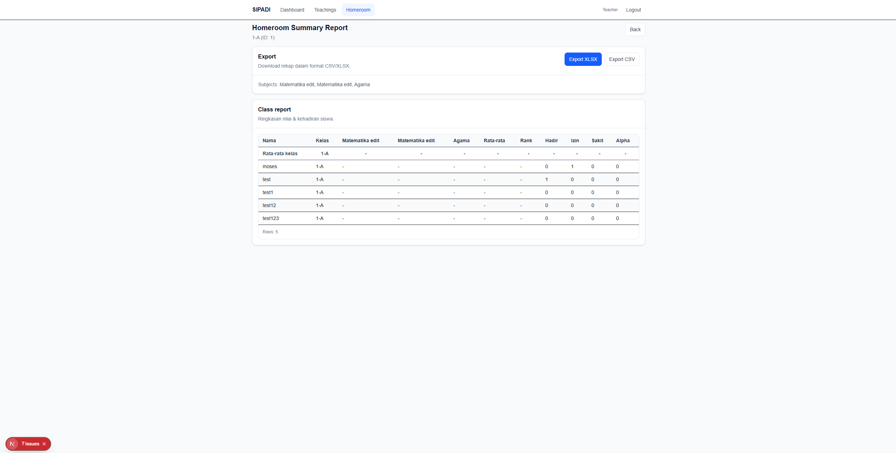
